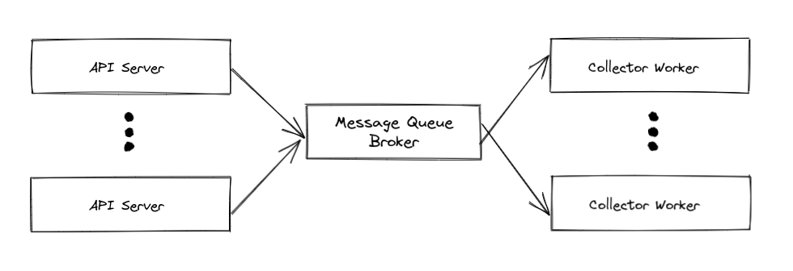
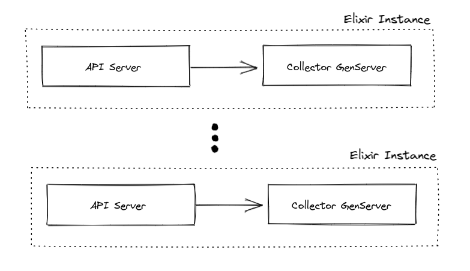

# High-ingestion-rate-demo

This demo is inspired by an article by Papercups.io on [how Genserver works based on Plausible source code](https://papercups.io/blog/genserver).

## Architecture Diagram

## Goals

- The worker must be durable where:
  - For continuous worker: upon receiving SIGTERM signal, it must finish the task in hand and commit the message to broker.
  - For batching worker: upon receiving SIGTERM signal, it must persist the data before exiting and commit the message to the broker.

### Non-Goals

## Types of Consumers

### Continuous Worker

[Source code](https://github.com/sdil/high-ingestion-rate-demo/blob/main/consumer/loop-graceful-shutdown.py)

Perform the operation on each message. The message will be blocked and performed sequentially.

### Batching Worker

[Source code](https://github.com/sdil/high-ingestion-rate-demo/blob/main/consumer/batching-graceful-shutdown.py)

Insert the data into a buffer queue, then at every interval perform a batch operation.

**Important Note**: The data received must be inserted into [Queue](https://docs.python.org/3/library/queue.html) and **NOT** list. This is because python queue has `get()` and `get_nowait()` functions which are suitable for multithreaded environment. If we're using list instead for buffer store, we might losing some data as another thread is manipulating the data.

## How to Run

Prerequisite:

- Has Go, Python 3 and Docker installed locally

1. Open terminal 1 and run `make producer`
2. Open terminal 2 and run `make consumer-batch` or `make consumer-loop`
3. Open terminal 3 and run `make load-test-100`
